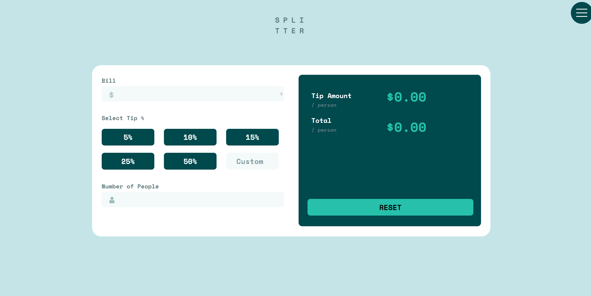
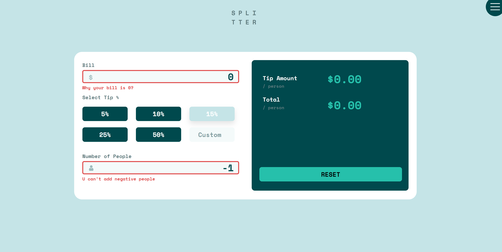
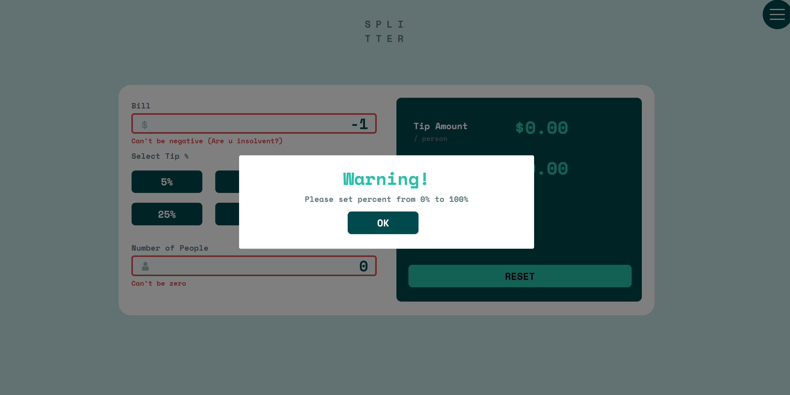
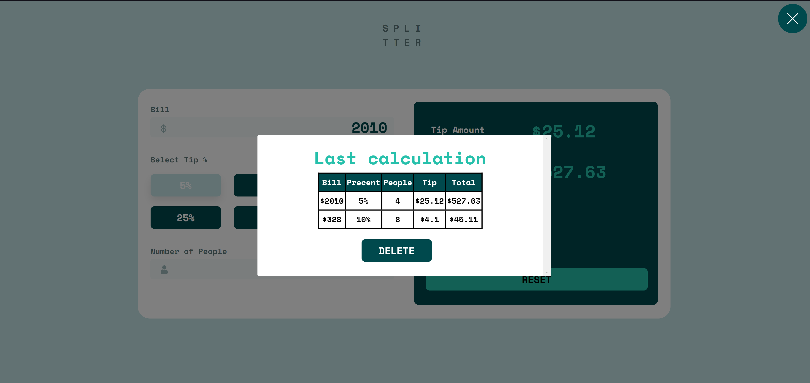

# Frontend Mentor - Tip calculator app


## Welcome! 👋

It is my solution for tip calculator - full responsive website for any devices.

I added special functionality and upgrade some:

✔️ File cookies for welcome user for first time visit

✔️ Save last calculation by set cookies and delete history by click button

✔️ Exstra pop-up for validation precent

✔️ Correct validation data

[Frontend Mentor](https://www.frontendmentor.io)

[Check out live web](https://647e3ffeeb86c8174536064d--earnest-speculoos-f37771.netlify.app)

Useful function for reset cookies:

```JavaScript
deleteAllCookiesExcept(cookieToKeep); //one parametr

//tests
//deleteAllCookiesExcept(""); -- delete all cookies

//deleteAllCookiesExcept("isCookie"); -- delete all cookies without cookie responsible for welcome popup
```

## My design

- Desktops

  

  

  

  

- Tablets and smartphones landscape mode

  

- Smartphones

  

  
